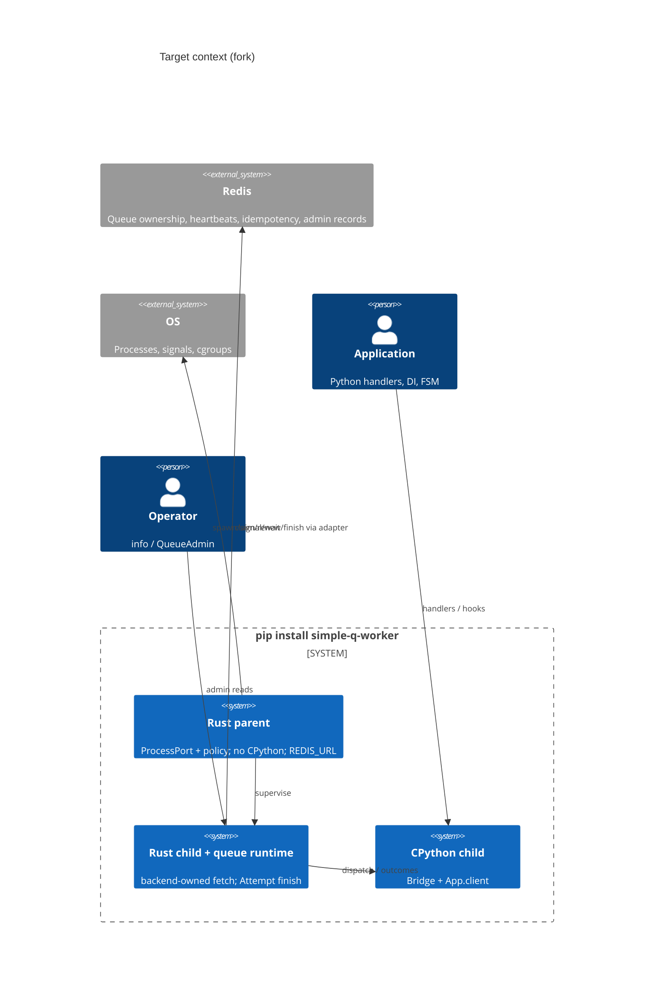
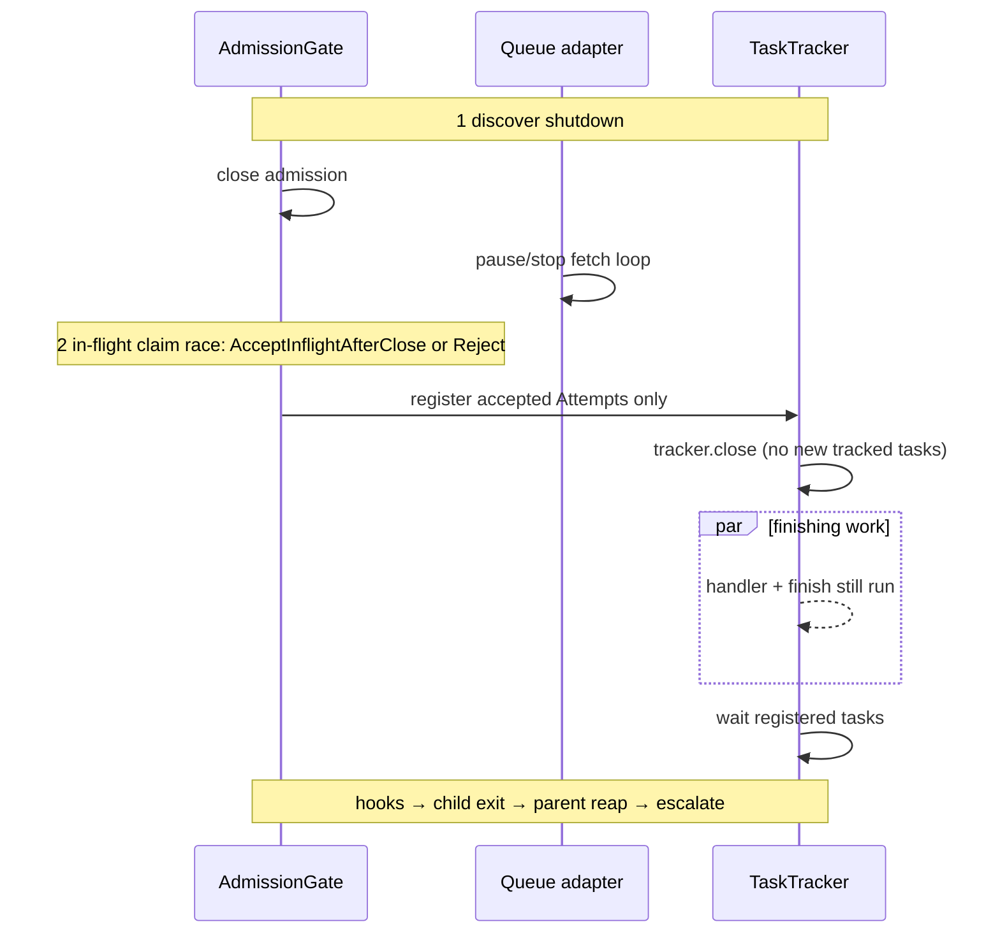
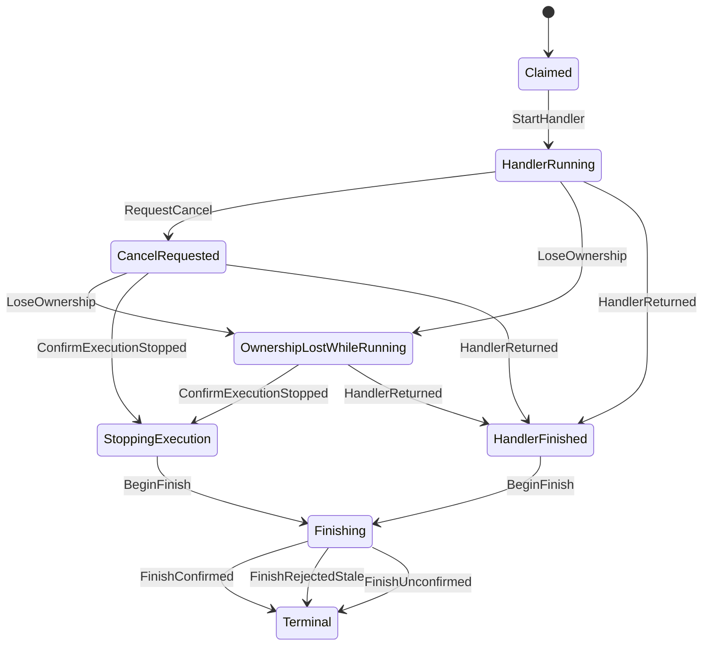

# Architecture diagrams (Stage B binding)

## Target context

```mermaid
C4Context
  title Target context (fork)
  System_Ext(redis, "Redis", "Queue ownership, heartbeats, idempotency, admin records")
  System_Ext(os, "OS", "Processes, signals, cgroups")
  Person(app_dev, "Application", "Python handlers, DI, FSM")
  Person(ops, "Operator", "info / QueueAdmin")
  System_Boundary(sq, "pip install simple-q-worker") {
    System(parent, "Rust parent", "ProcessPort + policy; no CPython; REDIS_URL")
    System(child, "Rust child + queue runtime", "backend-owned fetch; Attempt finish")
    System(py, "CPython child", "Bridge + App.client")
  }
  Rel(app_dev, py, "handlers / hooks")
  Rel(ops, child, "admin reads")
  Rel(parent, os, "spawn/signal/wait")
  Rel(parent, child, "supervise")
  Rel(child, redis, "claim/renew/finish via adapter")
  Rel(child, py, "dispatch / outcomes")
```

## Drain barrier (admission ≠ TaskTracker)

```mermaid
sequenceDiagram
  participant Gate as AdmissionGate
  participant Backend as Queue adapter
  participant Tr as TaskTracker
  Note over Gate,Tr: 1 discover shutdown
  Gate->>Gate: close admission
  Backend->>Backend: pause/stop fetch loop
  Note over Gate: 2 in-flight claim race: AcceptInflightAfterClose or Reject
  Gate->>Tr: register accepted Attempts only
  Tr->>Tr: tracker.close (no new tracked tasks)
  par finishing work
    Tr-->>Tr: handler + finish still run
  end
  Tr->>Tr: wait registered tasks
  Note over Gate,Tr: hooks → child exit → parent reap → escalate
```

## Attempt lifecycle (no early Terminal)

```mermaid
stateDiagram-v2
  [*] --> Claimed
  Claimed --> HandlerRunning: StartHandler
  HandlerRunning --> CancelRequested: RequestCancel
  HandlerRunning --> OwnershipLostWhileRunning: LoseOwnership
  HandlerRunning --> HandlerFinished: HandlerReturned
  CancelRequested --> OwnershipLostWhileRunning: LoseOwnership
  CancelRequested --> StoppingExecution: ConfirmExecutionStopped
  CancelRequested --> HandlerFinished: HandlerReturned
  OwnershipLostWhileRunning --> StoppingExecution: ConfirmExecutionStopped
  OwnershipLostWhileRunning --> HandlerFinished: HandlerReturned
  StoppingExecution --> Finishing: BeginFinish
  HandlerFinished --> Finishing: BeginFinish
  Finishing --> Terminal: FinishConfirmed
  Finishing --> Terminal: FinishRejectedStale
  Finishing --> Terminal: FinishUnconfirmed
```
